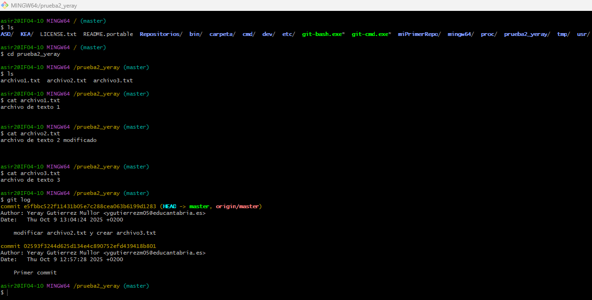
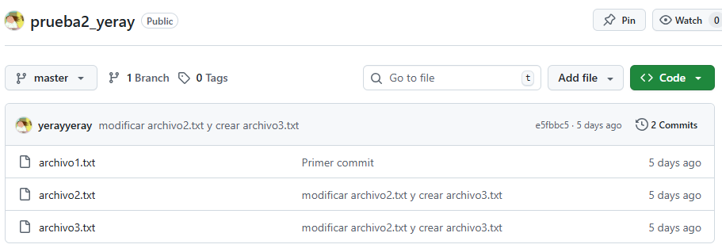
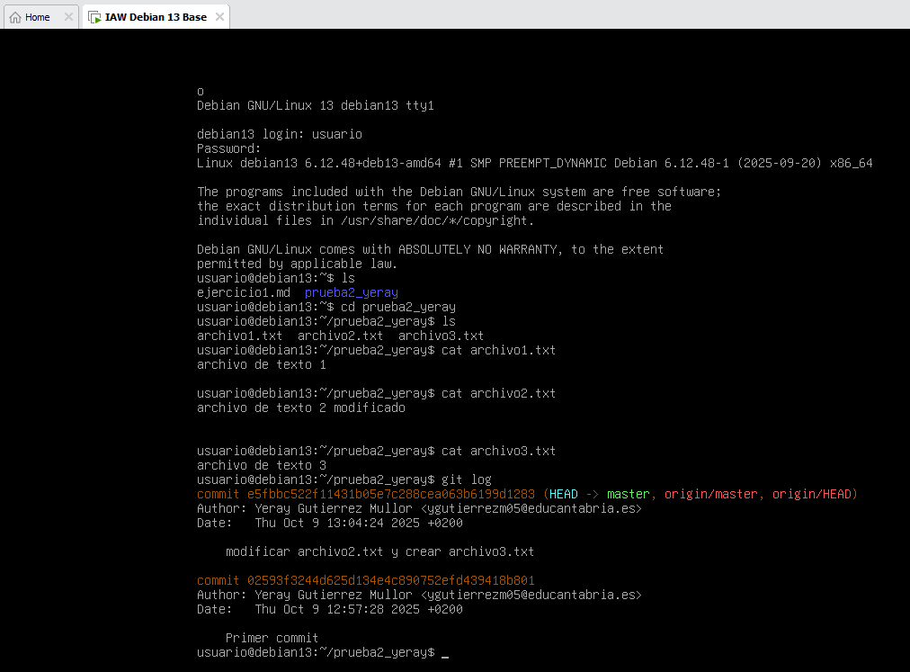

# Documentacion del paso 14
---
## Creacion del Repositorio
Para esto primero debemos crear el repositorio local en windows con el siguiente comando en la carpeta en la que se quiere crear el repositorio:
> git init

## Conectar repositorio local a remoto
Esto se puede hacer con el siguiente comando:
> git remote add origin https://github.com/yerayyeray/prueba_yeray.git

## Subir datos al repositorio remoto
Lo cual se hace con el siguiente comando:
> git push -u origin master

## Clonar Repositorio a un Debian
Teniendo git instalado ejecutamos el siguiente comando:
> git clone https://github.com/yerayyeray/prueba_yeray.git

## Modificar un archivo en local y actualizar los cambios en el remoto
Modificamos un archivo con el comando:
> nano arhcivo1.txt

Guardamos los cambios y creamos el archivo3.txt:
> echo "Texto del archivo3" > archivo3.txt

comentamos los cambios con:
> git add .
> git commit -m "Añadir archivo3.txt y modificar el arhcivo1.txt"
> git push -u origin master

## Actualizar cambios en Debian
Para actualizar los cambios en debian utilizaremos el siguiente comando:
> git pull origin main

## Documentación con imagenes de los resultados
### Captura de pantalla del repositorio en git bash:

### Captura de pantalla del repositorio remoto en github:

### Captura de pantalla del repositorio clonado en debian:
