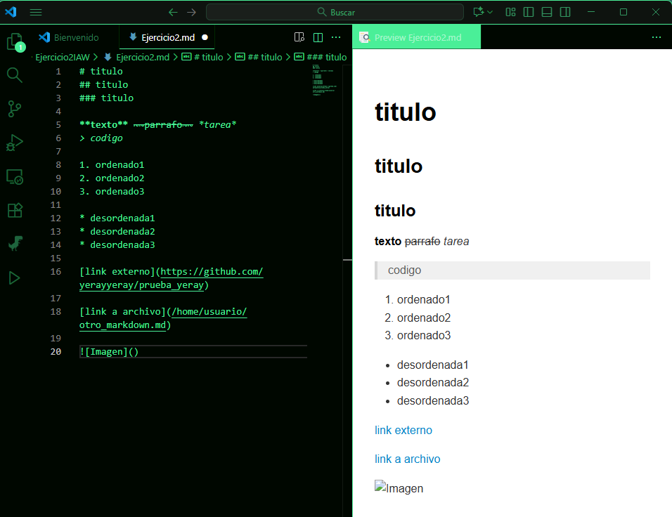

# Titulo1
---
## Subtitulo 1
### Subtitulo 2

**texto** ~~parrafo~~ *tarea* 

> codigo

1. ordenado1
2. ordenado2
3. ordenado3 

* desordenada1
* desordenada2
* desordenada3

[link externo](https://github.com/yerayyeray/prueba_yeray)

[link a archivo](archivo.txt)

| Columna 1 | Columna 2 | Columna 3 |
|---|---|---|
| Fila 1 | Fila 1 | Fila 1 |
| Fila 2 | Fila 2 | Fila 2 |