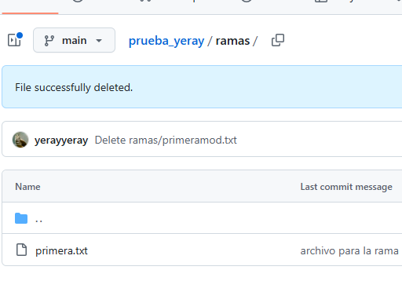

# Ejercicio 3
---
## Crear la rama Primera
Utilizar los siguientes comandos para crear la rama "primera"

## Crear fichero y fusionar con rama principal
Con los siguientes comandos se crea un archivo .txt para utilizar en la fusion de ramas y que se vea que esta correcto

## Crear rama Segunda
Crear la rama segunda

## Modificar archivo para conflicto
Modificar el archivo de antes para crear un conflicto al fusionar las ramas

## Fusionar rama
Fusionar las ramas para crear el conflicto debido a la modificacion del archivos

## Solucionar conflicto
Volver el archivo a su estado original y volver a fusionar para que no haya conflicto

## Ramas en github

